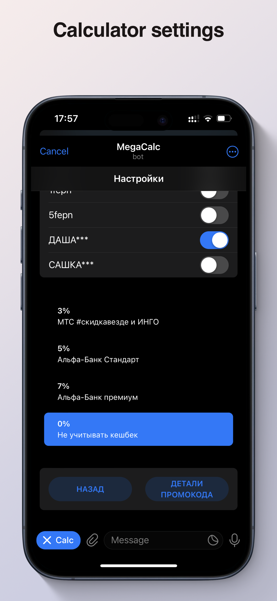
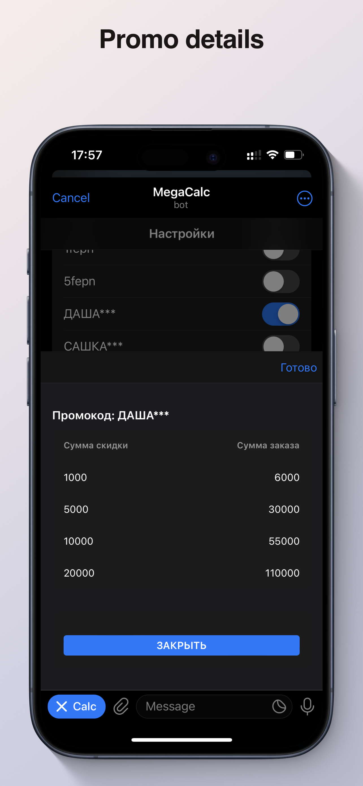
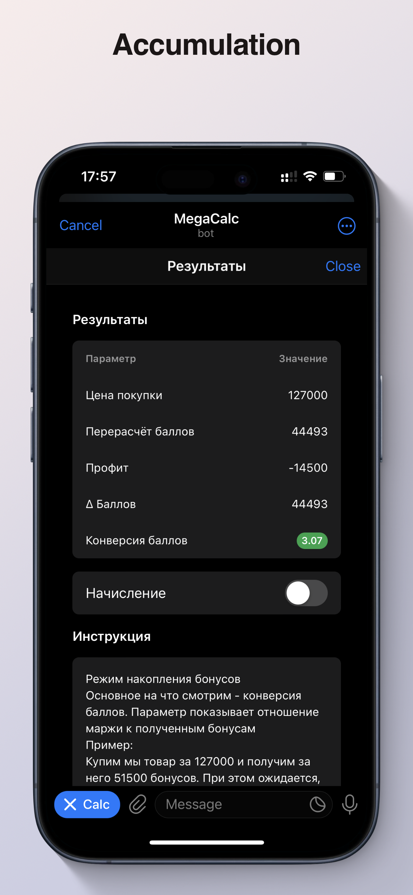
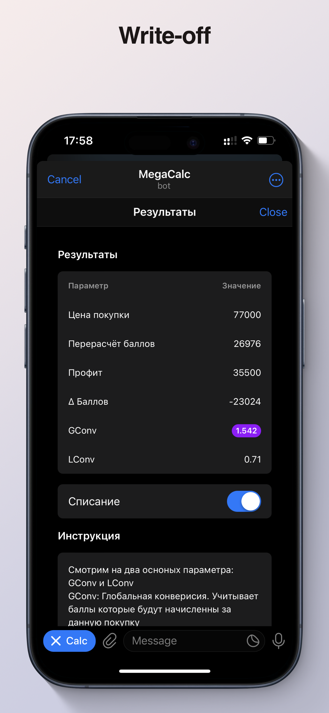

# Abuzometer-js

This is a SberMegaMarket Calculator with Telegram intergration! A tool made to help your shopping even more profitable!

[RU-Docs](/.github/docs/README-RU.md)


## Features

- Determine bonus obtainig efficiency.
- Select promocodes and desired cashback. Presets are in 'Settings' tab.
- Calculate effectiveness of the bonus write-offs.
- Calculate bonus conversions.
- Limit access to calculator via invite-codes or to memebres of telegram chat/group/channel
- Requests promocodes from backend server. 
- Stores user inputs and settings in LocalStorage


## Project Setup

```sh
npm install
```

### Compile and Hot-Reload for Development

```sh
npm run dev
```

### Compile and Minify for Production

```sh
npm run build
```

### Lint with [ESLint](https://eslint.org/)

```sh
npm run lint
```
## Settings Screen
[](.github/screenshots/2.png)

Promocodes are requested from backend server. Source will be provided in nearest future.

You can toggle any promocode you want and apply cashback if you're making paymanets using something except Sberbank. 

If Sberbank card or SberPya is used, leave filed as `0%`.

Promo detailes available under corresponding button.

[](.github/screenshots/3.png)

## Accumulation screen

Calculator has 2 modes: `Accumulation` and `Write-off`

In accumulation mode it calculates how efficient bonus gaining will be. The more bonuses and the less expenses - the better. Efficiency (e.g. `conversions`) is also higligthed with color based on WoT Olenemer.

[](.github/screenshots/4.png)

## Write-Off screen

2-nd mode, bonus `write-off`. Calculates how efficient you will convert bonuses into cash. GConv is shows Global Conversion. 

If you do partial conversion (which is the way-to-go usually), take GConv into consideration
### Example GConv usage:

You buy something for `147.000` and recieve `51.500` bonuses. Youd decide to write off `50.000` bonuses and at the end of the day you you sell this unit for `112.500` v-bucks. Your profit is `35.500` you loose `50.000` bonuses but you also get back `26.976`, so overall delta is `23024` bonuses

[](.github/screenshots/5.png)

Have a good shoppping!

```
 _____________________
|  _________________  |
| | malvere  3.1415 | |
| |_________________| |
|  ___ ___ ___   ___  |
| | 7 | 8 | 9 | | + | |
| |___|___|___| |___| |
| | 4 | 5 | 6 | | - | |
| |___|___|___| |___| |
| | 1 | 2 | 3 | | x | |
| |___|___|___| |___| |
| | . | 0 | = | | / | |
| |___|___|___| |___| |
|_____________________|
```
